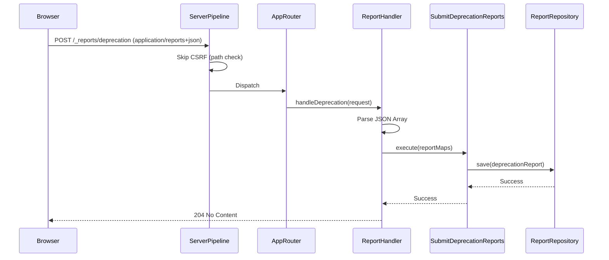

# Modification Design: Reporting API Implementation (Deprecation Reports)

## Overview
This modification implements the browser [Reporting API](https://developer.mozilla.org/en-US/docs/Web/API/Reporting_API) within the `clean_server` project. Specifically, it adds support for receiving and storing `DeprecationReport` objects sent by browsers when they encounter deprecated web platform features. 

The implementation follows Clean Architecture and Feature-First patterns, introducing a new `reporting` feature.

## Detailed Analysis
The Reporting API sends reports via a `POST` request with a `Content-Type: application/reports+json`. The body consists of a JSON array of report objects. Each object contains metadata (`type`, `url`, `age`, `user_agent`) and a specific `body` containing the report data.

### Goal
- Create an endpoint `/_reports/deprecation` to receive deprecation reports.
- Validate the `application/reports+json` content type.
- Parse the JSON array of reports.
- Filter for and process only `deprecation` types (as per the 1-to-1 mapping requirement).
- Store reports in an in-memory repository.
- Ensure the CSRF protection middleware does not block these automated browser requests.

## Alternatives Considered
- **Generic Report Storage**: Storing all report types in a single table/map with a JSON blob for the body. 
    - *Decision*: Rejected in favor of "Specific Entities" as requested by the user, which allows for better type safety and validation.
- **Unified Handler**: A single handler for all `/_reports/*` paths.
    - *Decision*: Rejected in favor of a 1-to-1 mapping between URLs and report types to keep handlers focused and aligned with the requested URL structure.

## Detailed Design

### Feature Structure
The new feature will be located at `lib/features/reporting/`:
```
lib/features/reporting/
├── data/
│   ├── mappers/
│   │   └── report_mapper.dart
│   └── repositories/
│       └── in_memory_report_repository.dart
├── domain/
│   ├── entities/
│   │   ├── report.dart (Base class)
│   │   └── deprecation_report.dart
│   ├── repositories/
│   │   └── report_repository.dart
│   └── use_cases/
│       └── submit_deprecation_reports.dart
└── presentation/
    └── handlers/
        └── report_handler.dart
```

### Domain Layer
- **`Report` (Entity)**: An abstract base class containing common fields: `id`, `type`, `url`, `userAgent`, `age`, and `receivedAt`.
- **`DeprecationReport` (Entity)**: Extends `Report` with fields from `DeprecationReportBody`: `featureId`, `message`, `sourceFile`, `lineNumber`, `columnNumber`, and `anticipatedRemoval`.
- **`ReportRepository` (Interface)**: Defines methods for saving and retrieving reports.
- **`SubmitDeprecationReports` (Use Case)**: Handles the logic of processing a list of report maps, converting them to entities, and saving them.

### Data Layer
- **`InMemoryReportRepository`**: Implements `ReportRepository` using an in-memory `Map`.
- **`ReportMapper`**: Provides extensions for converting between raw JSON maps and domain entities.

### Presentation Layer
- **`ReportHandler`**: 
    - Validates the `Content-Type` header.
    - Reads the request body as a JSON array.
    - Invokes the `SubmitDeprecationReports` use case.
    - Returns `204 No Content` on success.

### Infrastructure Changes
- **`AppRouter`**: Register the `POST /_reports/deprecation` route.
- **`ServiceLocator`**: Wire up the new repository, use case, and handler.
- **`csrfProtection` Middleware**: Update to exclude paths starting with `/_reports/`.

## Diagrams

### Request Flow


## Summary
The implementation introduces a robust way to collect browser-level deprecation reports. By following Clean Architecture, we ensure that adding more report types in the future (e.g., CSP violations) will be straightforward and consistent with the existing codebase.

## References
- [MDN: Reporting API](https://developer.mozilla.org/en-US/docs/Web/API/Reporting_API)
- [MDN: DeprecationReportBody](https://developer.mozilla.org/en-US/docs/Web/API/DeprecationReportBody)
- [W3C Reporting API Specification](https://w3c.github.io/reporting/)
