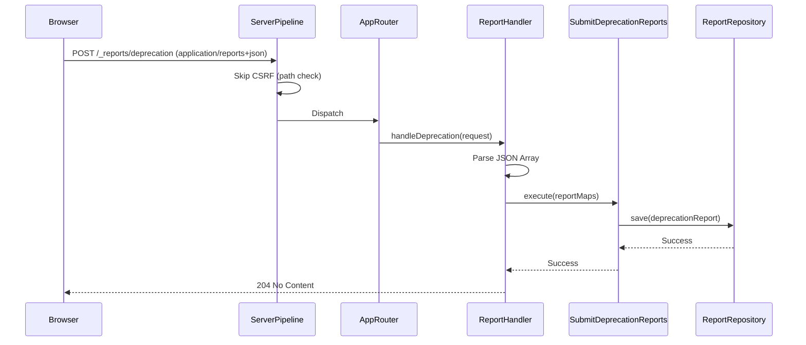

# Modification Design: Reporting API Implementation (Deprecation Reports)

## Overview
This modification implements the browser [Reporting API](https://developer.mozilla.org/en-US/docs/Web/API/Reporting_API) within the `clean_server` project. Specifically, it adds support for receiving and storing `DeprecationReport` objects sent by browsers when they encounter deprecated web platform features. 

The implementation follows Clean Architecture and Feature-First patterns, introducing a new `reporting` feature.

## Detailed Analysis
The Reporting API sends reports via a `POST` request with a `Content-Type: application/reports+json`. The body consists of a JSON array of report objects. Each object contains metadata (`type`, `url`, `age`, `user_agent`) and a specific `body` containing the report data.

### Goal
- Create a single endpoint `/_reports/default` to receive all browser reports.
- Validate the `application/reports+json` content type.
- Parse the JSON array of reports.
- Use pattern matching to process supported report types (starting with `deprecation`).
- Store reports in an in-memory repository.
- Ensure the CSRF protection middleware does not block these automated browser requests.

## Alternatives Considered
- **1-to-1 URL Mapping**: Having specific URLs for each report type.
    - *Decision*: Rejected because the Reporting API spec mandates that many reports (deprecations, crashes, interventions) are always sent to the endpoint named `default`.
- **Generic Report Storage**: Storing all report types in a single table/map with a JSON blob for the body. 
    - *Decision*: Rejected in favor of "Specific Entities" to maintain type safety for supported types.

## Detailed Design

### Feature Structure
The new feature will be located at `lib/features/reporting/`:
```
lib/features/reporting/
├── data/
│   ├── mappers/
│   │   └── report_mapper.dart
│   └── repositories/
│       └── in_memory_report_repository.dart
├── domain/
│   ├── entities/
│   │   ├── report.dart (Base class)
│   │   └── deprecation_report.dart
│   ├── repositories/
│   │   └── report_repository.dart
│   └── use_cases/
│       └── submit_reports.dart
└── presentation/
    └── handlers/
        └── report_handler.dart
```

### Domain Layer
- **`Report` (Entity)**: An abstract base class containing common fields.
- **`DeprecationReport` (Entity)**: Extends `Report` with deprecation-specific fields.
- **`ReportRepository` (Interface)**: Defines methods for saving and retrieving reports.
- **`SubmitReports` (Use Case)**: Processes the list of report maps, uses pattern matching to instantiate the correct entity for supported types, and saves them.

### Data Layer
- **`InMemoryReportRepository`**: Implements `ReportRepository`.
- **`ReportMapper`**: Provides extensions for conversion.

### Presentation Layer
- **`ReportHandler`**: 
    - Validates `Content-Type`.
    - Reads body as JSON array.
    - Invokes `SubmitReports` use case.
    - Returns `204 No Content`.

### Infrastructure Changes
- **`AppRouter`**: Register the `POST /_reports/default` route.
- **`ServiceLocator`**: Wire up `SubmitReports`.
- **`csrfProtection` Middleware**: Exclude `/_reports/`.
- **`ReportingHeaders` Middleware**: Set `default` endpoint to `/_reports/default`.

## Diagrams

### Request Flow


## Summary
The implementation introduces a robust way to collect browser-level deprecation reports. By following Clean Architecture, we ensure that adding more report types in the future (e.g., CSP violations) will be straightforward and consistent with the existing codebase.

## References
- [MDN: Reporting API](https://developer.mozilla.org/en-US/docs/Web/API/Reporting_API)
- [MDN: DeprecationReportBody](https://developer.mozilla.org/en-US/docs/Web/API/DeprecationReportBody)
- [W3C Reporting API Specification](https://w3c.github.io/reporting/)
